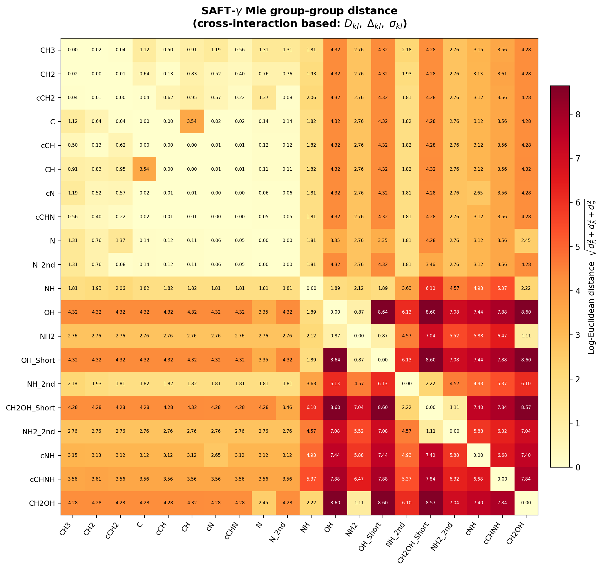
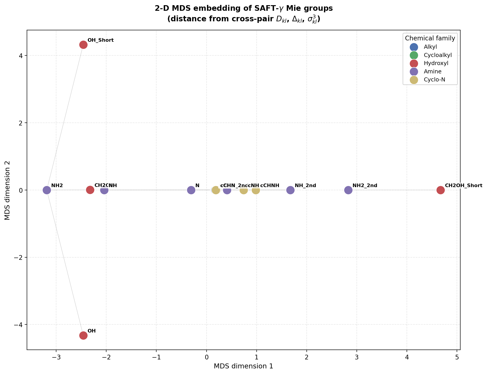
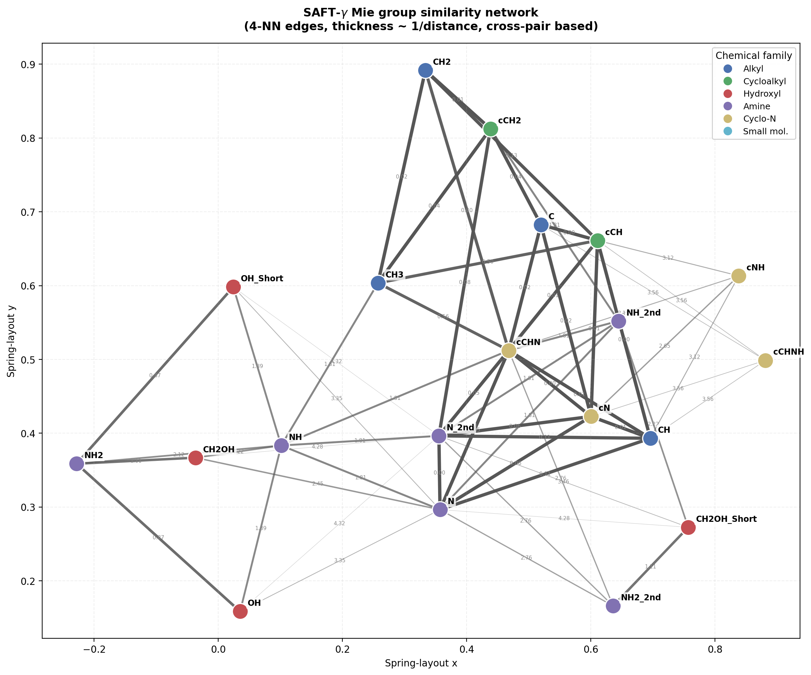
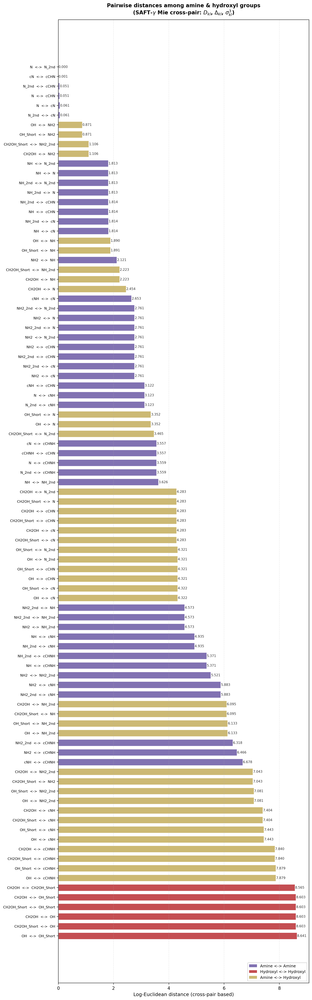
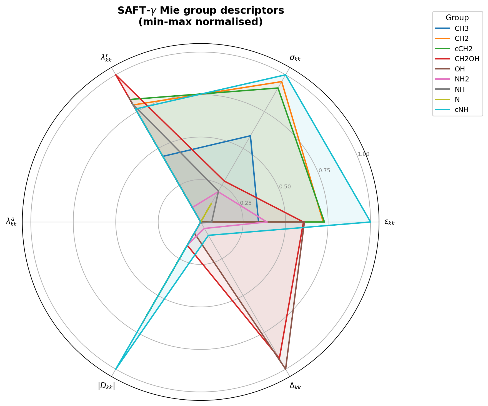

# SAFT-γ Mie Group Similarity & Molecule Ranking

Composition-agnostic similarity metrics for molecules represented by **SAFT-γ Mie group-contribution** vectors.  
Two complementary approaches are implemented, both reading from the same XML parameter database.

---

## Repository layout

```
├── database/
│   └── database.xml               # SAFT-γ Mie group parameters (self + cross)
├── scripts/
│   ├── compute_similarity.py      # Approach 1 – feature-based cosine similarity matrix
│   ├── saft_similarity.py         # Approach 2 – SAFT-γ Mie physics-based ranking
│   └── plot_group_similarity.py   # Visualisation – group-level similarity figures
├── figures/
│   ├── group_distance_heatmap.png
│   ├── group_mds_map.png
│   ├── group_similarity_network.png
│   ├── amine_hydroxyl_distances.png
│   └── group_radar_descriptors.png
├── similarity_matrix.npy          # 40×40 output of Approach 1
├── saft_pair_tables.json          # D_{kl} / Δ_{kl} pair tables (Approach 2)
├── ranking_vs_MEA.json            # Example ranking output (Approach 2)
└── README.md
```

---

## Groups of interest

Both scripts operate on the same 20 functional groups:

| # | Group | # | Group |
|---|-------|---|-------|
| 1 | `NH2_2nd` | 11 | `NH` |
| 2 | `NH_2nd` | 12 | `N` |
| 3 | `N_2nd` | 13 | `OH` |
| 4 | `CH3` | 14 | `OH_Short` |
| 5 | `CH2` | 15 | `cCH2` |
| 6 | `CH` | 16 | `cCH` |
| 7 | `C` | 17 | `cNH` |
| 8 | `CH2OH` | 18 | `cN` |
| 9 | `CH2OH_Short` | 19 | `cCHNH` |
| 10 | `NH2` | 20 | `cCHN` |

---

## Approach 1 – Feature-based soft-cosine similarity (`compute_similarity.py`)

### What it does

Builds a **20×20 similarity matrix** $\mathbf{S}$ that quantifies how similar each pair of SAFT-γ Mie groups is, based on standardised self- and cross-interaction feature vectors.

### Step-by-step

#### Step 1 — Parse the XML database

Extract per-group properties from `database.xml`:

- Number of segments $\nu_k$, shape factor $S_k$
- Self-dispersion: $\varepsilon_{kk}$, $\sigma_{kk}$, $\lambda^{\mathrm{rep}}_{kk}$, $\lambda^{\mathrm{att}}_{kk}$
- Association site counts: $n_H$, $n_e$, $n_a$
- Self-association totals: $\sum \varepsilon^{\mathrm{assoc}}_{kk}$, $\sum K_{kk}$
- Thermodynamic properties at $T_{\mathrm{ref}} = 298.15\;\mathrm{K}$: heat capacity $C_p^*$, enthalpy of formation $\hat{H}_f$, entropy of formation $\hat{S}_f$

Also parse all explicit cross-interaction entries $(\varepsilon_{kl},\;\lambda^{\mathrm{rep}}_{kl},\;\varepsilon^{\mathrm{assoc}}_{kl},\;K_{kl})$.

#### Step 2 — Build self-feature vector $\boldsymbol{\varphi}^{\mathrm{self}}_k$

For each group $k$, assemble an 11-dimensional vector:

```math
\boldsymbol{\varphi}^{\mathrm{self}}_k = \bigl[\,\nu_k,\; S_k,\; \ln\varepsilon_{kk},\; \ln\sigma_{kk},\; \lambda^{\mathrm{rep}}_{kk},\; \lambda^{\mathrm{att}}_{kk},\; n_H,\; n_e,\; n_a,\; \ln(1+\varepsilon^{\mathrm{assoc}}_{kk}),\; \ln(1+K_{kk})\,\bigr]
```

#### Step 3 — Build cross-feature vector $\boldsymbol{\varphi}^{\mathrm{cross}}_k$

For each group $k$ and every reference group $r$ in the list, extract a 4-dimensional cross fingerprint:

```math
\boldsymbol{f}_{k,r} = \bigl[\,\varepsilon_{kr},\; \lambda^{\mathrm{rep}}_{kr},\; \ln(1+\varepsilon^{\mathrm{assoc}}_{kr}),\; \ln(1+K_{kr})\,\bigr]
```

Concatenate over all 20 reference groups to get $\boldsymbol{\varphi}^{\mathrm{cross}}_k \in \mathbb{R}^{80}$.

#### Step 4 — Standardise and combine

Column-wise z-standardise both matrices, then form the combined feature:

```math
\boldsymbol{\phi}_k = \alpha\,\mathbf{z}^{\mathrm{self}}_k \;\|\; \beta\,\mathbf{z}^{\mathrm{cross}}_k
```

with default weights $\alpha = 0.7$, $\beta = 0.3$.

#### Step 5 — Compute similarity matrix

Normalise each $\boldsymbol{\phi}_k$ to unit length and compute:

```math
S_{ij} = \frac{\hat{\boldsymbol{\phi}}_i \cdot \hat{\boldsymbol{\phi}}_j + 1}{2} \;\in [0,\,1]
```

The diagonal is set to 1, and $\mathbf{S}$ is symmetrised.

#### Step 6 — Expand to 40×40

For two-component mixture use, the matrix is block-duplicated:

```math
\mathbf{S}_{40\times40} = \begin{pmatrix} \mathbf{S} & \mathbf{S} \\ \mathbf{S} & \mathbf{S} \end{pmatrix}
```

and saved as `similarity_matrix.npy`.

---

## Approach 2 – SAFT-γ Mie physics-based molecule ranking (`saft_similarity.py`)

### What it does

Given a **target molecule** (as a group-count vector) and a set of **candidate molecules**, ranks candidates by "nearest thermodynamic behaviour" using five physics-derived scalars — **dispersion strength** $\bar{D}$, **association strength** $\bar{A}$, **chain length** $m$, **packing proxy** $\bar{\sigma}^3$, and **shape average** $\bar{S}$ — without running a full equation of state.

The method strictly follows the SAFT-γ Mie group-contribution framework as described by Papaioannou et al. [1], Dufal et al. [2], and Haslam et al. [3].

### Theoretical background

The SAFT-γ Mie equation of state writes the residual Helmholtz energy as a sum of contributions:

```math
\frac{A^{\mathrm{res}}}{Nk_BT} = \frac{A^{\mathrm{mono}}}{Nk_BT} + \frac{A^{\mathrm{chain}}}{Nk_BT} + \frac{A^{\mathrm{assoc}}}{Nk_BT}
```

Rather than evaluating the full Helmholtz function, this script extracts **proxy quantities** that capture the dominant group-level contributions to dispersion and association without performing a thermodynamic state calculation.

---

### Step-by-step

#### Step 1 — Parse the XML database

From `database.xml` extract:

- **Per-group self-interaction parameters**: $\varepsilon_{kk}$, $\sigma_{kk}$, $\lambda^r_{kk}$, $\lambda^a_{kk}$, number of segments $\nu_k$, shape factor $S_k$
- **Association site multiplicities**: $\{m_{k,a}\}$ — e.g. group `NH2` may have 2 `H`-type sites and 1 `e1`-type site
- **Self-association interactions**: site labels, $\varepsilon^{\mathrm{assoc}}_{kk,ab}$, $K_{kk,ab}$
- **Cross-interaction entries**: explicit unlike-pair dispersion ($\varepsilon_{kl}$, $\sigma_{kl}$, $\lambda^r_{kl}$, $\lambda^a_{kl}$) and association ($\varepsilon^{\mathrm{assoc}}_{kl,ab}$, $K_{kl,ab}$) with site labels

Cross entries are stored with the mirrored pair $(l, k)$ having **swapped site labels**, so that `site1` always refers to the first group in the key.

---

#### Step 2 — Combining rules for missing cross parameters

When the database does not provide an explicit cross entry for a parameter in pair $(k, l)$, **SAFT-γ Mie combining rules** are applied:

##### Segment diameter — arithmetic mean ([1] Eq. 24)

```math
\sigma_{kl} = \frac{\sigma_{kk} + \sigma_{ll}}{2}
```

##### Mie exponents — nonlinear combining rule ([1] Eq. 23)

Applied independently to both the repulsive and attractive exponents:

```math
\lambda^r_{kl} = 3 + \sqrt{(\lambda^r_{kk} - 3)(\lambda^r_{ll} - 3)}
```

```math
\lambda^a_{kl} = 3 + \sqrt{(\lambda^a_{kk} - 3)(\lambda^a_{ll} - 3)}
```

This rule preserves the constraint $\lambda > 3$ and correctly reduces to the self-interaction value when $k = l$.

##### Dispersion energy — modified Berthelot rule with σ³ correction ([1] Eq. 25)

```math
\varepsilon_{kl} = \sqrt{\varepsilon_{kk}\,\varepsilon_{ll}} \;\cdot\; \frac{\sqrt{\sigma_{kk}^3\,\sigma_{ll}^3}}{\sigma_{kl}^3}
```

The $\sigma^3$ correction ensures thermodynamic consistency: it accounts for the different effective volumes of unlike-sized segments.

##### Priority

If the database provides a non-zero explicit value for any individual parameter ($\varepsilon_{kl}$, $\sigma_{kl}$, $\lambda^r_{kl}$, $\lambda^a_{kl}$), **the database value is used** and the combining rule is only applied to the remaining parameters.

---

#### Step 3 — Mie prefactor $C_{kl}$

The Mie potential between segments of groups $k$ and $l$ is:

```math
u^{\mathrm{Mie}}(r) = C_{kl}\,\varepsilon_{kl}\left[\left(\frac{\sigma_{kl}}{r}\right)^{\!\lambda^r_{kl}} - \left(\frac{\sigma_{kl}}{r}\right)^{\!\lambda^a_{kl}}\right]
```

where the normalisation constant ensures $u(\sigma) = -\varepsilon$ at the minimum ([1] Eq. 2):

```math
C_{kl} = \frac{\lambda^r_{kl}}{\lambda^r_{kl} - \lambda^a_{kl}} \left(\frac{\lambda^r_{kl}}{\lambda^a_{kl}}\right)^{\!\lambda^a_{kl} / (\lambda^r_{kl} - \lambda^a_{kl})}
```

---

#### Step 4 — Dispersion proxy $D_{kl}$: first-order perturbation ($a_1$-like)

The dominant contribution to intermolecular attraction in SAFT comes from the first-order monomer perturbation term $a_1$ ([1] Eqs. 19–20). For each group pair we compute a **proxy** proportional to $a_1$:

```math
D_{kl} = C_{kl}\,\varepsilon_{kl}\,\sigma_{kl}^3 \left[a_1^S(\eta;\,\lambda^a_{kl}) - a_1^S(\eta;\,\lambda^r_{kl})\right]
```

where $a_1^S(\eta;\lambda)$ is the Sutherland-$\lambda$ perturbation integral evaluated at a fixed reference packing fraction $\eta_{\mathrm{ref}}$.

##### Sutherland perturbation integral

In the full SAFT-γ Mie theory, the Sutherland integral $a_1^S$ is parameterised by a polynomial in $\eta$ with $\lambda$-dependent coefficients. For the **proxy** we use the leading-order mean-field / contact-value approximation:

```math
a_1^S(\eta;\lambda) \approx -\frac{1}{\lambda - 3}\;\frac{1 - \eta/2}{(1 - \eta)^3}
```

This captures the dominant dependence on both $\lambda$ (potential range) and $\eta$ (packing), and is exact in the van-der-Waals-1-fluid limit.

##### Reference packing fraction

```math
\eta_{\mathrm{ref}} = 0.40
```

This is a liquid-like reference state; the proxy does not depend on the actual density of the system. Any monotonic change of $\eta_{\mathrm{ref}}$ rescales all $D_{kl}$ values by the same factor and therefore does not affect the ranking.

---

#### Step 5 — Association proxy $\Delta_{kl}$: Wertheim TPT1 strength

Hydrogen bonding is described via Wertheim's thermodynamic perturbation theory of first order (TPT1), as formulated in SAFT-γ Mie ([1] Eqs. 36–38).

##### Single site-pair interaction

For a specific pair of association sites $a$ on group $k$ and $b$ on group $l$:

```math
\Delta_{kl,ab}(T, \eta) = F_{kl,ab}\;\cdot\;K_{kl,ab}\;\cdot\;I_{kl}(\eta)
```

where:

**Mayer-f function** — the Boltzmann factor for the square-well association potential:

```math
F_{kl,ab} = \exp\!\left(\frac{\varepsilon^{\mathrm{assoc}}_{kl,ab}}{T}\right) - 1
```

**Bonding volume** — the geometric parameter $K_{kl,ab}$ (units: m³), taken directly from the database.

**Association kernel** — in the full theory, $I_{kl}$ involves the Mie radial distribution function $g^{\mathrm{Mie}}(\sigma_{kl})$ evaluated at contact distance. For the proxy we use the leading hard-sphere (Carnahan–Starling) contact value:

```math
I_{kl} \approx g^{HS}(\sigma_{kl};\,\eta) = \frac{1 - \eta/2}{(1 - \eta)^3}
```

Higher-order $a_1$/$a_2$ corrections to $g^{\mathrm{Mie}}$ require the full Helmholtz machinery and are omitted.

##### Total pair association strength

Sum over all site-site interactions, weighted by site multiplicities ([1] Eq. 38):

```math
\Delta_{kl}(T, \eta) = \sum_{a \in k}\;\sum_{b \in l} m_{k,a}\;m_{l,b}\;\Delta_{kl,ab}
```

where $m_{k,a}$ is the multiplicity of site type $a$ on group $k$ (e.g., `NH2` has $m_{H}=2$, $m_{e1}=1$).

If no association interaction exists between groups $k$ and $l$, then $\Delta_{kl} = 0$.

##### Reference temperature

```math
T_{\mathrm{ref}} = 298.15\;\mathrm{K}
```

---

#### Step 6 — Build pair tables

Pre-compute $D_{kl}$ and $\Delta_{kl}(T_{\mathrm{ref}}, \eta_{\mathrm{ref}})$ for every unordered pair among the 20 groups of interest, yielding two symmetric $20 \times 20$ tables:

- **$D_{kl}$** — dispersion (a₁-proxy), units: $\mathrm{J \cdot m^3}$. All values are negative (net attractive).
- **$\Delta_{kl}$** — association (Wertheim TPT1), units: $\mathrm{m^3}$. Zero for non-associating pairs.

These tables are saved as `saft_pair_tables.json`.

---

#### Step 7 — Segment fractions $x_{s,k}$

SAFT-γ Mie treats molecules as heteronuclear chains of fused segments. The total chain length of molecule $i$ is ([1] Eqs. 7–8):

```math
m_i = \sum_k n_k \,\nu_k \,S_k
```

where $n_k$ is the multiplicity of group $k$ in the molecule, $\nu_k$ is the number of identical segments per group, and $S_k$ is the shape factor (the fraction of segment $k$ that contributes to the chain).

The **segment fraction** of group $k$ in molecule $i$ is:

```math
x_{s,k} = \frac{n_k\,\nu_k\,S_k}{m_i}
```

These sum to unity: $\sum_k x_{s,k} = 1$.

---

#### Step 8 — Molecule signature $\{\bar{D},\;\bar{A},\;m,\;\bar{\sigma}^3,\;\bar{S}\}$

Each molecule is characterised by a **5-scalar signature**.

##### 1. Dispersion signature

The pair-averaged dispersion, using the same double-sum structure as the monomer Helmholtz contribution ([1] Eq. 19):

```math
\bar{D}_i = \sum_k \sum_l x_{s,k}\;x_{s,l}\;D_{kl}
```

##### 2. Association signature

```math
\bar{A}_i = \sum_k \sum_l x_{s,k}\;x_{s,l}\;\Delta_{kl}
```

##### 3. Chain length

```math
m_i = \sum_k n_k\,\nu_k\,S_k
```

##### 4. Packing proxy (segment-averaged excluded volume)

The mean cubic segment diameter, weighted by segment fractions:

```math
\bar{\sigma}^3_i = \sum_k \sum_l x_{s,k}\;x_{s,l}\;\sigma_{kl}^3
```

This quantity is proportional to the effective excluded volume of the molecule's segments. It captures **size differences** between molecules that share similar dispersion energies but differ in segment diameter (e.g. groups with large $\sigma$ but moderate $\varepsilon$). In the full SAFT-γ Mie theory, $\sigma_{kl}^3$ appears in the hard-sphere reference term and in the $\varepsilon$ combining rule.

##### 5. Shape average (segment-fraction-weighted shape factor)

```math
\bar{S}_i = \sum_k x_{s,k}\;S_k
```

The shape factor $S_k$ controls what fraction of each segment participates in the fused chain. A single sum (not a double sum) is used because the shape factor is a **per-group** property, not a pair interaction. Molecules with the same groups but different shape-factor distributions will differ in this component.

##### Key properties

- Because the double sums use *segment fractions* (which normalise to 1), molecules composed of a single group type always yield $\bar{D} = D_{kk}$, $\bar{A} = \Delta_{kk}$, and $\bar{\sigma}^3 = \sigma_{kk}^3$ regardless of how many copies of that group are present.
- The chain length $m_i$, packing proxy $\bar{\sigma}^3_i$, and shape average $\bar{S}_i$ together distinguish molecules with identical group *types* but different *sizes* or *architectures* (e.g. cyclobutane, cyclopentane, cyclohexane all contain only `cCH2` but differ in $m$).

---

#### Step 9 — Log-Euclidean distance

Compare a candidate signature $(\bar{D}_c,\,\bar{A}_c,\,m_c,\,\bar{\sigma}^3_c,\,\bar{S}_c)$ against the target $(\bar{D}_t,\,\bar{A}_t,\,m_t,\,\bar{\sigma}^3_t,\,\bar{S}_t)$ using a **log-Euclidean metric** in 5-D signature space:

```math
d_D = \ln\frac{|\bar{D}_c|}{|\bar{D}_t|}, \qquad d_A = \ln\frac{\bar{A}_c + S_0}{\bar{A}_t + S_0}, \qquad d_m = \ln\frac{m_c}{m_t}
```

```math
d_{\sigma} = \ln\frac{\bar{\sigma}^3_c}{\bar{\sigma}^3_t}, \qquad d_S = \ln\frac{\bar{S}_c}{\bar{S}_t}
```

```math
\mathcal{D} = \sqrt{w_D\,d_D^2 \;+\; w_A\,d_A^2 \;+\; w_m\,d_m^2 \;+\; w_{\sigma}\,d_{\sigma}^2 \;+\; w_S\,d_S^2}
```

##### Why logarithmic?

The five signature components span many orders of magnitude ($D \sim 10^{-26}$, $A \sim 10^{-25}$, $m \sim 1$, $\sigma^3 \sim 10^{-29}$, $S \sim 0.5$). A direct Euclidean distance would be dominated by whichever component has the largest absolute value. The logarithm converts multiplicative ratios into additive differences, making the metric **scale-invariant**: doubling $\bar{D}$ contributes the same $|\ln 2|$ regardless of the absolute magnitude.

##### Association floor $S_0$

```math
S_0 = 10^{-28}\;\mathrm{m^3}
```

This prevents $\ln(0)$ singularities when one or both molecules have zero association ($\bar{A} = 0$). Physically, $S_0$ represents a negligible background association strength much smaller than any real H-bonding interaction ($\Delta \sim 10^{-26}$ to $10^{-25}$), so it does not distort the ranking among associating molecules.

##### Weights

Default values:

| Weight | Symbol | Default | Role |
|--------|--------|---------|------|
| Dispersion | $w_D$ | 1.0 | Mie attraction strength |
| Association | $w_A$ | 3.0 | H-bonding — upweighted as it is the primary differentiator for amine/alkanolamine screening |
| Chain length | $w_m$ | 0.7 | Molecular size — downweighted to avoid over-penalising small size differences |
| Packing | $w_{\sigma}$ | 1.0 | Segment excluded volume |
| Shape | $w_S$ | 0.5 | Shape factor contribution — downweighted as it varies less across the candidate set |

These can be adjusted to emphasise specific physical aspects. An alternative **inverse-variance** weighting mode is also implemented, which automatically normalises each component by its variance across the candidate set so that all features contribute equally on average.

---

#### Step 10 — Rank candidates

Sort all candidates by ascending $\mathcal{D}$. The output includes each candidate's group-count vector, full 5-scalar signature, and distance.

---

### Summary of assumptions and approximations

| # | Assumption | Justification |
|---|-----------|---------------|
| 1 | **No full Helmholtz evaluation** — only proxy quantities $D_{kl}$ and $\Delta_{kl}$ are computed | We need *relative* ordering, not absolute thermodynamic properties; the leading-order terms dominate the ranking |
| 2 | **Sutherland $a_1^S$ in mean-field limit** — polynomial parameterisation replaced by contact-value expression | The mean-field form captures the correct $\lambda$ and $\eta$ dependence; polynomial coefficients are not needed for a proxy |
| 3 | **Association kernel $I_{kl} \approx g^{HS}$** — Mie RDF reduced to Carnahan–Starling hard-sphere contact value | The HS contribution is the dominant term; $a_1$/$a_2$ corrections to the RDF require the full EOS and are state-dependent |
| 4 | **Fixed reference state** $(\eta_{\mathrm{ref}} = 0.40,\;T_{\mathrm{ref}} = 298.15\;\mathrm{K})$ | The proxy is evaluated at a single liquid-like state point; any monotonic rescaling by $\eta$ cancels in the log-ratio distance |
| 5 | **Segment fractions** $x_{s,k}$ used instead of intramolecular pair counts | Consistent with SAFT-γ Mie monomer contribution formalism ([1] Eqs. 7–8, 19) |
| 6 | **Chain length** $m_i$ included as a distance component | Necessary to distinguish molecules with identical group types but different multiplicities (e.g. cycloalkanes); $m$ enters SAFT via the chain term $A^{\mathrm{chain}}$ |
| 7 | **Packing proxy** $\bar{\sigma}^3_i$ included as a distance component | Captures segment-size differences; $\sigma^3$ appears in the HS reference and the $\varepsilon$ combining rule |
| 8 | **Shape average** $\bar{S}_i$ included as a distance component | The shape factor $S_k$ modulates how each group contributes to the chain; averaging over segment fractions gives a molecular-level architecture indicator |
| 9 | **Cross parameters**: database values have priority; combining rules used as fallback | Standard practice in SAFT-γ Mie; the nonlinear $\lambda$ and $\sigma^3$-corrected $\varepsilon$ rules are physically motivated |
| 10 | **Association**: only site-site interactions present in the database are included; no "inferred" cross-association | Conservative approach — avoids spurious association between groups not parameterised to interact |

---

## Visualisation – Group-level similarity (`plot_group_similarity.py`)

This script reuses the **same SAFT-γ Mie pair tables** computed by `saft_similarity.py` — specifically $D_{kl}$, $\Delta_{kl}$, and $\sigma_{kl}$ — to visualise group-level similarity. All figures are saved to `figures/`.

### Group-group distance metric

The distance between two groups $k$ and $l$ measures how much their **cross interaction** deviates from the geometric mean of their self interactions, in three components:

```math
d_D = \ln \frac{|D_{kl}|}{\sqrt{|D_{kk}|\,|D_{ll}|}}
```

```math
d_{\Delta} = \ln \frac{\Delta_{kl} + S_0}{\sqrt{(\Delta_{kk} + S_0)(\Delta_{ll} + S_0)}}
```

```math
d_{\sigma} = \ln \frac{\sigma_{kl}^3}{\sqrt{\sigma_{kk}^3\,\sigma_{ll}^3}}
```

```math
d_{kl} = \sqrt{d_D^2 + d_{\Delta}^2 + d_{\sigma}^2}
```

Each ratio equals 1 (and the log equals 0) when the cross quantity matches the geometric mean of the self quantities — i.e. when the two groups interact with each other just as strongly as they interact with themselves. Groups with $d_{kl} \approx 0$ are **thermodynamically compatible** in the SAFT-γ Mie sense.

The same floor $S_0 = 10^{-28}\;\mathrm{m^3}$ is used for association to avoid $\ln(0)$ singularities.

---

### Figure 1 — Distance heatmap



Symmetric matrix of all pairwise group distances, with numerical annotations. Rows and columns are reordered by a **greedy nearest-neighbour chain** (starting from the first group, repeatedly jump to the nearest unvisited group) so that similar groups cluster together visually. Colourmap: `YlOrRd` (yellow = close, red = far).

---

### Figure 2 — 2-D MDS embedding



The $N \times N$ distance matrix is embedded into 2 dimensions using **classical (metric) Multi-Dimensional Scaling** (Torgerson, 1952):

1. Square the distance matrix: $\mathbf{D}^{(2)}$
2. Double-centre: $\mathbf{B} = -\tfrac{1}{2}\,\mathbf{H}\,\mathbf{D}^{(2)}\,\mathbf{H}$, where $\mathbf{H} = \mathbf{I} - \tfrac{1}{N}\mathbf{11}^\top$
3. Eigendecompose $\mathbf{B}$ and take the two largest eigenvalues $\lambda_1, \lambda_2$ with corresponding eigenvectors $\mathbf{v}_1, \mathbf{v}_2$
4. Coordinates: $\mathbf{X} = [\mathbf{v}_1\sqrt{\lambda_1},\;\mathbf{v}_2\sqrt{\lambda_2}]$

Groups are colour-coded by **chemical family** (Alkyl, Cycloalkyl, Hydroxyl, Amine, Cyclo-N, Small molecule). Light grey lines connect the closest 30% of pairs.

---

### Figure 3 — Similarity network



Each group is a node positioned by a **Fruchterman–Reingold force-directed layout** (initialised from MDS). Edges connect each group to its **4 nearest neighbours**. Edge properties encode distance:

- **Thickness** $\propto 1/d$ — thicker lines mean more similar groups
- **Opacity** $\propto 1/d$ — faint lines mean distant groups
- **Midpoint labels** show the numerical distance

Nodes are coloured by chemical family.

---

### Figure 4 — Amine & hydroxyl distance ranking



Horizontal bar chart of all pairwise distances among 14 nitrogen- and oxygen-containing groups (6 amine types, 4 cyclo-N types, 4 hydroxyl types), sorted from most similar (top) to most different (bottom). Bar colour indicates the pair type:

- **Purple** — Amine ↔ Amine
- **Red** — Hydroxyl ↔ Hydroxyl
- **Gold** — Amine ↔ Hydroxyl (cross-family)

This figure directly answers questions like *"how far is `NH2` from `NH`?"* or *"is `NH2` more similar to `OH` or to `N`?"*

---

### Figure 5 — Radar chart of group descriptors



Spider plot of 6 self-pair SAFT-γ Mie descriptors for a representative subset of groups (`CH3`, `CH2`, `cCH2`, `CH2OH`, `OH`, `NH2`, `NH`, `N`, `cNH`, `H2O`). The 6 axes are:

| Axis | Quantity | Source |
|------|----------|--------|
| $\varepsilon_{kk}$ | Dispersion well depth | Database self-interaction |
| $\sigma_{kk}$ | Segment diameter | Database self-interaction |
| $\lambda^r_{kk}$ | Repulsive exponent | Database self-interaction |
| $\lambda^a_{kk}$ | Attractive exponent | Database self-interaction |
| $\|D_{kk}\|$ | Dispersion proxy (a₁) | Computed by `saft_similarity.py` |
| $\Delta_{kk}$ | Self-association strength | Computed by `saft_similarity.py` |

All axes are **min-max normalised** to $[0, 1]$ across the displayed groups. This shows at a glance which descriptors differentiate groups: for example, associating groups (`NH2`, `OH`, `H2O`) extend far on the $\Delta_{kk}$ axis while alkyl groups (`CH3`, `CH2`) collapse to zero there.

---

## Running the scripts

```bash
# Approach 1: build the 40×40 similarity matrix
python scripts/compute_similarity.py

# Approach 2: rank compounds against MEA (default target)
python scripts/saft_similarity.py

# Visualisation: generate all 5 group-similarity figures
python scripts/plot_group_similarity.py
```

### Outputs

| File | Description |
|------|-------------|
| `similarity_matrix.npy` | 40×40 group similarity matrix (Approach 1) |
| `similarity_matrix_plot.png` | Heatmap visualisation of $\mathbf{S}$ |
| `saft_pair_tables.json` | $D_{kl}$ and $\Delta_{kl}$ pair tables (Approach 2) |
| `ranking_vs_MEA.json` | Full ranking with 5-scalar signatures, weights, and distances |
| `figures/group_distance_heatmap.png` | Group-group distance heatmap |
| `figures/group_mds_map.png` | 2-D MDS embedding of groups |
| `figures/group_similarity_network.png` | 4-NN similarity network graph |
| `figures/amine_hydroxyl_distances.png` | Amine/hydroxyl pairwise distance bar chart |
| `figures/group_radar_descriptors.png` | Radar chart of raw SAFT descriptors |

---

## Database format

The XML database (`database/database.xml`) follows the SAFT-γ Mie group-contribution schema:

- **`<compounds>`** — molecule definitions as lists of group multiplicities
- **`<groups>`** — per-group self-interaction parameters:
  - `<numberOfSegments>` ($\nu_k$), `<shapeFactor>` ($S_k$)
  - `<selfInteraction><dispersion>`: $\varepsilon_{kk}$, $\sigma_{kk}$, $\lambda^r_{kk}$, $\lambda^a_{kk}$
  - `<selfInteraction><association>`: site-pair interactions with $\varepsilon^{\mathrm{assoc}}_{kk,ab}$, $K_{kk,ab}$
  - `<associationSites>`: site multiplicities $m_{k,a}$
- **`<crossInteractions>`** — explicit unlike-pair parameters (dispersion and association)

---

## References

1. V. Papaioannou, T. Lafitte, C. Avendaño, C. S. Adjiman, G. Jackson, E. A. Müller, A. Galindo, *J. Chem. Phys.* **140**, 054107 (2014).
2. S. Dufal, T. Lafitte, A. J. Haslam, A. Galindo, G. N. I. Clark, C. Vega, G. Jackson, *J. Chem. Eng. Data* **59**, 3272–3288 (2014).
3. A. J. Haslam, A. Galindo, G. Jackson, "SAFT-γ Mie group-contribution framework" — comprehensive review of the group-contribution methodology.

---

## Dependencies

- Python ≥ 3.10
- `numpy`
- `matplotlib` (Approach 1 plotting + group-similarity visualisation)
